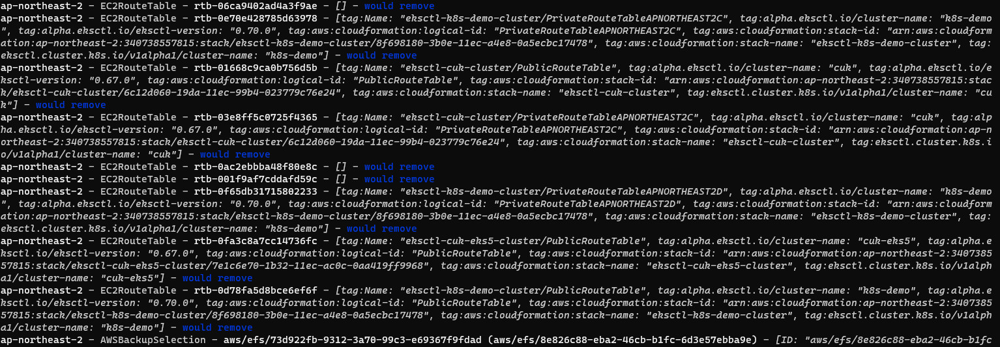
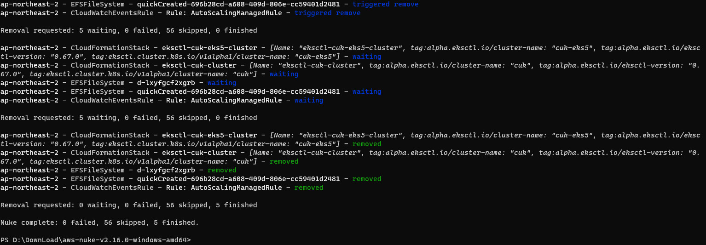

# AWS 모든 리소스 삭제 하기

## 유의 사항
- AWS의 모든 리소스를 삭제하는 것이므로, 현재 사용하고 AWS 계정의 중요한 리소스가 있는 확인하고 진행바랍니다.


## AWS Nuke 다운 받기
- `https://github.com/rebuy-de/aws-nuke/releases/tag/v2.15.0` 에서 자신의 운영체제에 맞는 Nuke를 다운 받는다.


## 압축 해제 및 설정파일 생성 config.yml 

- 다운 받은 프로그램을 압축 해제 하고, 해제한 디렉토리로 들어가 config.yaml 이라는 설정 파일을 생성한다.

```
regions:
- ap-northeast-2  #삭제하고자 하는 리전

account-blocklist:
- "999999999999" # production

accounts:
  "000000000000": {} # aws-nuke-example      00000000000 대신 자신의 계정 번호를 기입한다.
```


## aws cli 사용을 위한 설정


- AWS cli 사용을 위해 terminal에서 다음과 같이 AWS cli configure 설정을 수행한다.
 
```
aws configure
```


- account alias 사용 설정
  + 자신의 계정에 별명을 설정한다. (실수 방지를 위해 사용)

```
aws iam create-account-alias --account-alias cukedu
```

## AWS Nuke 실행

- 압축 해제한 디렉토리에서 다음 명령어를 입력


```
aws-nuke-v2.15.0-windows-amd64.exe -c config.yml --no-dry-run
```

- 이때 alias를 물어보는데, 앞서 설정한 `cukedu`라는 alias 를 입력

```
Do you really want to nuke the account with the ID 340738557815 and the alias 'cukedu'?
Do you want to continue? Enter account alias to continue.
> cukedu
```

- 2차적으로 정말 해당 리소스를 삭제할 것인지를 물어보면, 또 다시 alias를 입력

- 삭제 과정이 여러번 반복하며 계정 전체의 리소스를 한꺼번에 삭제



- 다음과 같은 finished 메시지가 나오면, 모든 리소스 삭제를 성공적으로 수행




- 만약 성공적으로 삭제 되지 않으면, 로그에 삭제 실패한 리소스를 파악하여, 대시보드에서 강제 삭제를 수행하고, 다시 nuke를 실행하는 과정을 반복한다.